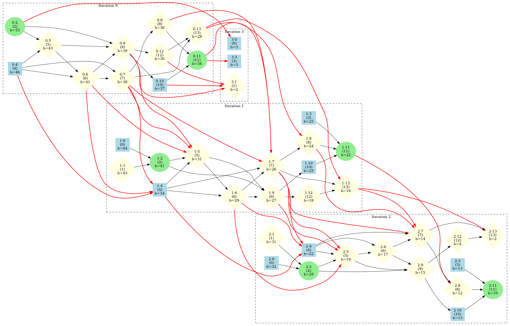
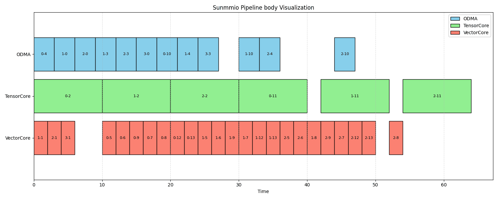
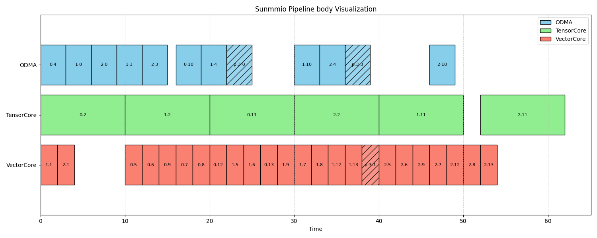

# Pipeline (Software Pipeline Scheduling and Injection)

## 1 Motivation

The core architectural feature of the A4E NPU is **multi-engine decoupling** (e.g., the ODMA engine handles data movement, the TensorCore handles matrix computations, and the VectorCore handles vector computations). If the code is executed sequentially, the computation engines will sit idle while the DMA is moving data, leading to extremely low hardware utilization.
Although traditional GPU compilers can hide latency through software pipelining and hardware's implicit Warp scheduling, for the threadless, purely statically scheduled A4E NPU, we must explicitly express the temporal dependencies between different hardware engines within the IR. Meanwhile, in deep pipelines, to prevent newly fetched data from overwriting data currently being computed (WAR/WAW conflicts), Multiversion Buffers must be explicitly managed.

## 2 Design

We designed a Pipeline Pass tailored specifically for the multi-engine architecture of the A4E NPU, primarily divided into two core phases: "Pipeline Planning" and "Pipeline Injection":

- **Pipeline Planning:**
  - **Step 1: Label statements as Producer, Consumer, or Both.**
    - Utilizing TileLang's native recognition patterns. For non-composite statements, if a write to a shared buffer within the statement is completed by the global memory, the statement is a Producer; otherwise, it is a Consumer. Producer patterns only appear in `dma_copy` and `BufferStore`. For composite statements like `IfStmt` or `SeqStmt`, if the labels on their subtrees differ, the statement's label is marked as Both.

  - **Step 2: Identify Buffers requiring Multi-versioning based on the labels generated in Step 1.**
    - **Step 2.1: Utilize TileLang's native recognition patterns.**
      1. If a Buffer is written by a producer and read by a consumer, it can be multi-versioned.
      2. If a Buffer's first write precedes its last read, and the first write statement of the Buffer only reads from a global buffer, it can be multi-versioned.
    - **Step 2.2: Improved heuristic expansion strategy.**
      - We discovered that TileLang's native recognition patterns are overly conservative, thus we introduced an improved strategy: If all writes to a Buffer are performed by **multi-versionable Buffers** or global memory, then that Buffer can also be multi-versioned. Following this strategy, the set of multi-versioned buffers is iteratively expanded until it converges.

  - **Step 3: Identify Prologue statements.**
    - The producer statements in the 0-th iteration serve as the Prologue (used to initially fill the pipeline).

  - **Step 4: Identify Body statements.**
    - Suppose the current iteration is the $k$-th loop of the original loop, unrolled `num_stages` times. Then the current unrolled iteration contains: non-producer statements from the $k$-th iteration, all statements from the $k+1$-th to $k+num\_stages-1$-th iterations, and producer statements from the $k+num\_stages$-th iteration.

  - **Step 5: Identify Epilogue statements.**
    - Based on the modulo relationship between the original loop count and the unroll count, the remaining unallocated computation statements are added to the Epilogue (used to drain the pipeline).

  - **Step 6: Construct the Directed Acyclic Graph (DAG).**
    - A Dependency Graph is established based on the statement sequences corresponding to each stage. Since explicit unrolling is performed here, this is a Directed Acyclic Graph. Statements act as nodes, and dependencies as directed edges.
    

  - **Step 7: Calculate Node Priorities (Bottom Level).**
    - The delay for nodes in the DAG is predicted based on a Cost Model (temporarily set to fixed weights). The Bottom Level for each node is calculated according to the DAG. This value can be viewed as a priority; the higher the value, the more critical it is in the DAG (Critical Path), and the higher priority it needs to be completed.

  - **Step 8: Two-phase List Scheduling and Prefetch Optimization.**
    - **Initial Greedy Scheduling**: Determine the positions of statements in the pipeline based on the calculated priorities. If a Device (ODMA, TensorCore, VectorCore) is idle, execute the currently runnable statement with the highest priority.
    
    - **Problem Identified**: We observed in experiments that naive greedy preemption could introduce extra bubbles. Because when high-priority statements cannot be run, the device executes "non-urgent" statements (such as **data prefetching for the next iteration**), which inadvertently occupies precious device time windows.
    - **Heuristic Improvement Strategy**: To solve the above problem, we separate "data prefetching for the next iteration" from the main pipeline layout. We wait until the computation tasks of the current main pipeline are scheduled, and then "insert" the prefetch tasks into the Idle Gaps of the devices in the pipeline based on dependencies. This strategy achieves true seamless overlap.
    

  - **Step 9: Record Annotations.**
    - Record the planned Prologue, Body, Epilogue sequences, and version information into the annotations of the Block, passing them to the next Injection phase. The Planning Pass concludes here.

- **Pipeline Injection:**
  - **Step 1: Global Multiversioning.**
    - Globally multi-version the buffers that require it, meaning an additional dimension is added to the outermost layer of their shape. During the initial rewrite, the index of the newly added multi-version dimension is defaulted to 0.

  - **Step 2: Unroll the Prologue.**
    - Generate code based on the Prologue sequence generated during the planning phase. In this stage, the index of the multi-version dimension remains 0 throughout, as the pipeline is just starting to fill and only the first buffer block is used.

  - **Step 3: Unroll the Body.**
    - This is the core part where the pipeline runs fully loaded.
    - **Loop Variable Replacement**: The original loop variable `i` is replaced by `unroll_count * for_node->loop_var + current_statement's_iteration + for_node->min`.
    - **Version Index Allocation**: The index of the multi-version dimension is dynamically replaced by `current_statement's_iteration % unroll_count`.
    - *Note*: The "current_statement's_iteration" here refers to the logical iteration round determined during the planning phase (for example, "1-2" in the layout graph indicates this is the 2nd statement of the 1st iteration, hence its iteration value is 1). This modulo operation realizes the alternation of different iterations on physical slots (Token Synchronization).

  - **Step 4: Unroll the Epilogue.**
    - Used to drain the pipeline after the main loop concludes.
    - **Loop Variable Replacement**: The original loop variable is replaced by `new_extent * unroll_count + current_statement's_iteration + for_node->min`.
    - **Version Index Allocation**: The index of the multi-version dimension is fixed at `current_statement's_iteration` to ensure reading the correct data version left behind by the main loop.

## 3 Implementation

The core logic is implemented separately in `src/transform/sunmmio_pipeline_planning.cc` and `src/transform/inject_sunmmio_pipeline.cc`, strictly corresponding to the Design in Section 4.2:

- **Phase One: Planning Phase (`sunmmio_pipeline_planning.cc`)**
  - **Role and Buffer Recognition (Corresponds to Design Steps 1-2)**:
    - The `SunmmioRoleMarker` class is responsible for traversing the IR. It intercepts `tl.dma_copy` and `BufferStore` and identifies them as Producers, while intercepting other operators as Consumers.
    - When detecting `versioned_buffers`, a fix-point iteration algorithm based on Use-Def chains is implemented. It initially collects Buffers that alternate between reading and writing, and then continually expands the set of multi-versioned buffers based on the heuristic rule "if write operations all originate from multi-versioned buffers or global", until it converges.
  - **Sequence Partitioning (Corresponds to Design Steps 3-5)**:
    - `SunmmioPipelinePlanner` is responsible for virtually unrolling the original loop. Based on the mathematical relationship between the iteration index `k` and `num_stages`, it explicitly classifies statements and pushes them into the `prologue_stmts`, `body_stmts`, and `epilogue_stmts` arrays.
  - **Dependency Graph and Priority Calculation (Corresponds to Design Steps 6-7)**:
    - `Scheduler::BuildDependencyGraph` precisely analyzes memory read/writes (RAW, WAR, WAW) via `RegionIntersect` to construct a Directed Acyclic Graph (DAG) for the unrolled statement sequence.
    - It assigns a weight (Delay) to each node and calculates the `bottom_level` of each node bottom-up, serving as the absolute priority for scheduling.
  - **Heuristic List Scheduling (Corresponds to Design Step 8)**:
    - `CriticalPathPipeline` implements Two-phase List Scheduling with prefetch optimization. In the first phase, it greedily assigns main pipeline computation tasks to ODMA, TensorCore, and VectorCore based on `bottom_level`. In the second phase, it traverses the generated scheduling timeline and precisely inserts "data prefetching for the next iteration" tasks (usually `dma_copy`) into the Idle Gaps of the ODMA engine, eliminating bubbles caused by preemption.

- **Phase Two: Injection Phase (`inject_sunmmio_pipeline.cc`)**
  - **Global Multiversioning (Corresponds to Design Injection Step 1)**:
    - `SunmmioMultiVersionBufferRewriter` intercepts `Allocate` nodes in the IR. For Buffers marked in the `versioned_buffers` set, it rewrites their `shape` (inserting a `num_stages` dimension at the outermost layer) and replaces the initial access indices to this Buffer with `0` globally throughout the graph.
  - **Loop Restructuring and Index Replacement (Corresponds to Design Injection Step 2-4)**:
    - `SunmmioPipelineInjector` is responsible for replacing a single `For` loop with a sequentially executed three-segment code block.
    - **Prologue Generation**: Calls `EmitImpl`, keeping the version index at 0.
    - **Body Generation**: Delves deep into the loop body via `PipelineBodyRewriter`. It uses `Substitute` to replace the original `loop_var` (applying the formula `unroll * i + iter + min`). Most crucially, it intercepts `BufferLoad/Store` accesses to multi-versioned buffers, hardcoding their outermost access index to `iter % unroll` to achieve physical alternation of Tokens.
    - **Epilogue Generation**: Similarly, it adjusts the loop variable formula and fixes the version index to the final `iter` state, draining the pipeline.

## 4 Example

Because the IR after pipelining is too long, here used a python version of the example.

**Before Pipeline Optimization：**

```python
# Sequential execution: ODMA and TensorCore wait for each other, no overlap
for k in T.Pipelined(loop_range, num_stages=num_stages):
    T.copy(K[bz, by, k * block_N : (k + 1) * block_N, :], K_shared)
    if is_causal:
        for i, j in T.Parallel(block_M, block_N):
            acc_s[i, j] = T.if_then_else(bx * block_M + i >= k * block_N + j, 0, -T.infinity(acc_s.dtype))
    else:
        for i, j in T.Parallel(block_M, block_N):
            acc_s[i, j] = T.if_then_else(k * block_N + j >= seq_len, -T.infinity(acc_s.dtype), 0)
    T.gemm(Q_shared, K_shared, acc_s, transpose_B=True, policy=T.GemmWarpPolicy.FullRow)
    T.copy(V[bz, by, k * block_N : (k + 1) * block_N, :], V_shared)
    T.copy(scores_max, scores_max_prev)
    # T.reduce_max(acc_s, scores_max, dim=1, clear=False)
    # fake operations, retaining read & write buffers
    for i in T.Parallel(block_M):
        scores_max[i] = acc_s[i, 0]

    for i in T.Parallel(block_M):
        scores_max[i] = T.max(scores_max[i], scores_max_prev[i])
    for i in T.Parallel(block_M):
        scores_scale[i] = T.exp2(scores_max_prev[i] * scale - scores_max[i] * scale)
    for i, j in T.Parallel(block_M, dim):
        acc_o[i, j] *= scores_scale[i]
    for i, j in T.Parallel(block_M, block_N):
        acc_s[i, j] = T.exp2(acc_s[i, j] * scale - scores_max[i] * scale)
    T.copy(acc_s, acc_s_cast)
    T.gemm(acc_s_cast, V_shared, acc_o, policy=T.GemmWarpPolicy.FullRow)
    # T.reduce_sum(acc_s, scores_sum, dim=1)
    # fake operations, retaining read & write buffers
    for i in T.Parallel(block_M):
        scores_sum[i] = acc_s[i, 0]

    for i in T.Parallel(block_M):
        logsum[i] = logsum[i] * scores_scale[i] + scores_sum[i]
```

**After Pipeline Optimization (Multiversion & Loop Restructuring)：**

```python
T.copy(Q[bz, by, bx * block_M : (bx + 1) * block_M, :], Q_shared)
T.fill(acc_o, 0)
T.fill(logsum, 0)
T.fill(scores_max, -T.infinity(accum_dtype))

T.copy(K[bz, by, 0 * block_N : (0 + 1) * block_N, :], K_shared[0, :, :])
if not is_causal:
    for i, j in T.Parallel(block_M, block_N):
        acc_s[0, i, j] = T.if_then_else(0 * block_N + j >= seq_len, -T.infinity(acc_s.dtype), 0)
T.copy(V[bz, by, 0 * block_N : (0 + 1) * block_N, :], V_shared[0, :, :])
trip_count = 10
for k in T.serial(trip_count):
    T.gemm(Q_shared, K_shared[0, :, :], acc_s[0, :, :], transpose_B=True, policy=T.GemmWarpPolicy.FullRow)
    T.copy(scores_max, scores_max_prev)
    for i, j in T.Parallel(block_M, block_N):
        acc_s[1, i, j] = T.if_then_else(k * block_N + j >= seq_len, -T.infinity(acc_s.dtype), 0)
    for i, j in T.Parallel(block_M, block_N):
        acc_s[2, i, j] = T.if_then_else(k * block_N + j >= seq_len, -T.infinity(acc_s.dtype), 0)
    T.copy(K[bz, by, k * 96 + 32 : k * 96 + 64, :], K_shared[1, :, :])
    T.copy(K[bz, by, k * 96 + 64 : k * 96 + 96, :], K_shared[2, :, :])
    T.copy(V[bz, by, k * 96 + 32 : k * 96 + 64, :], V_shared[1, :, :])

    for i in T.Parallel(block_M):
        scores_max[i] = acc_s[0, i, 0]

    T.gemm(Q_shared, K_shared[1, :, :], acc_s[1, :, :], transpose_B=True, policy=T.GemmWarpPolicy.FullRow)

    for i in T.Parallel(block_M):
        scores_max[i] = T.max(scores_max[i], scores_max_prev[i])
    T.copy(V[bz, by, k * 96 + 64 : k * 96 + 96, :], V_shared[2, :, :])
    for i, j in T.Parallel(block_M, block_N):
        acc_s[0, i, j] = T.exp2(acc_s[0, i, j] * scale - scores_max[i] * scale)
    T.copy(acc_s[0, :, :], acc_s_cast[0, :, :])
    for i in T.Parallel(block_M):
        scores_scale[i] = T.exp2(scores_max_prev[i] * scale - scores_max[i] * scale)
    for i, j in T.Parallel(block_M, dim):
        acc_o[i, j] *= scores_scale[i]
    T.copy(scores_max, scores_max_prev)

    T.gemm(acc_s_cast[0, :, :], V_shared[0, :, :], acc_o, policy=T.GemmWarpPolicy.FullRow)

    for i in T.Parallel(block_M):
        scores_sum[0, i] = acc_s[0, i, 0]
    for i in T.Parallel(block_M):
        scores_max[i] = acc_s[1, i, 0]

    T.copy(K[bz, by, k * 96 + 96 : k * 96 + 128, :], K_shared[0, :, :])

    for i in T.Parallel(block_M):
        scores_max[i] = T.max(scores_max[i], scores_max_prev[i])

    T.copy(V[bz, by, k * 96 + 96 : k * 96 + 128, :], V_shared[0, :, :])

    for i in T.Parallel(block_M):
        logsum[i] = logsum[i] * scores_scale[i] + scores_sum[0, i]

    for i, j in T.Parallel(block_M, block_N):
        acc_s[1, i, j] = T.exp2(acc_s[1, i, j] * scale - scores_max[i] * scale)
    T.copy(acc_s[1, :, :], acc_s_cast[1, :, :])
    for i in T.Parallel(block_M):
        scores_scale[i] = T.exp2(scores_max_prev[i] * scale - scores_max[i] * scale)

    T.gemm(Q_shared, K_shared[2, :, :], acc_s[2, :, :], transpose_B=True, policy=T.GemmWarpPolicy.FullRow)

    for i, j in T.Parallel(block_M, dim):
        acc_o[i, j] *= scores_scale[i]
    T.copy(scores_max, scores_max_prev)

    for i in T.Parallel(block_M):
        scores_sum[1, i] = acc_s[1, i, 0]
    for i in T.Parallel(block_M):
        logsum[i] = logsum[i] * scores_scale[i] + scores_sum[1, i]

    T.gemm(acc_s_cast[1, :, :], V_shared[1, :, :], acc_o, policy=T.GemmWarpPolicy.FullRow)

    for i in T.Parallel(block_M):
        scores_max[i] = acc_s[2, i, 0]
    for i in T.Parallel(block_M):
        scores_max[i] = T.max(scores_max[i], scores_max_prev[i])
    for i, j in T.Parallel(block_M, block_N):
        acc_s[2, i, j] = T.exp2(acc_s[2, i, j] * scale - scores_max[i] * scale)
    T.copy(acc_s[2, :, :], acc_s_cast[2, :, :])
    for i in T.Parallel(block_M):
        scores_scale[i] = T.exp2(scores_max_prev[i] * scale - scores_max[i] * scale)
    for i in T.Parallel(block_M):
        scores_sum[2, i] = acc_s[2, i, 0]
    for i, j in T.Parallel(block_M, dim):
        acc_o[i, j] *= scores_scale[i]
    T.gemm(acc_s_cast[2, :, :], V_shared[2, :, :], acc_o, policy=T.GemmWarpPolicy.FullRow)
    for i in T.Parallel(block_M):
        logsum[i] = logsum[i] * scores_scale[i] + scores_sum[2, i]

T.gemm(Q_shared, K_shared[0, :, :], acc_s[0, :, :], transpose_B=True, policy=T.GemmWarpPolicy.FullRow)
T.copy(scores_max, scores_max_prev)
for i, j in T.Parallel(block_M, block_N):
    acc_s[1, i, j] = T.if_then_else(num_stages * trip_count * block_N + j >= seq_len, -T.infinity(acc_s.dtype), 0)
T.copy(K[bz, by, num_stages * trip_count * block_N + 32 : num_stages * trip_count * block_N + 64, :], K_shared[1, :, :])
T.copy(V[bz, by, num_stages * trip_count * block_N + 32 : num_stages * trip_count * block_N + 64, :], V_shared[1, :, :])
for i in T.Parallel(block_M):
    scores_max[i] = acc_s[0, i, 0]
T.gemm(Q_shared, K_shared[1, :, :], acc_s[1, :, :], transpose_B=True, policy=T.GemmWarpPolicy.FullRow)
for i in T.Parallel(block_M):
    scores_max[i] = T.max(scores_max[i], scores_max_prev[i])
for i, j in T.Parallel(block_M, block_N):
    acc_s[0, i, j] = T.exp2(acc_s[0, i, j] * scale - scores_max[i] * scale)
T.copy(acc_s[0, :, :], acc_s_cast[0, :, :])
for i in T.Parallel(block_M):
    scores_scale[i] = T.exp2(scores_max_prev[i] * scale - scores_max[i] * scale)
for i, j in T.Parallel(block_M, dim):
    acc_o[i, j] *= scores_scale[i]
T.copy(scores_max, scores_max_prev)
T.gemm(acc_s_cast[0, :, :], V_shared[0, :, :], acc_o, policy=T.GemmWarpPolicy.FullRow)
for i in T.Parallel(block_M):
    scores_sum[0, i] = acc_s[0, i, 0]
for i in T.Parallel(block_M):
    scores_max[i] = acc_s[1, i, 0]
for i in T.Parallel(block_M):
    scores_max[i] = T.max(scores_max[i], scores_max_prev[i])
for i in T.Parallel(block_M):
    logsum[i] = logsum[i] * scores_scale[i] + scores_sum[0, i]
for i, j in T.Parallel(block_M, block_N):
    acc_s[1, i, j] = T.exp2(acc_s[1, i, j] * scale - scores_max[i] * scale)
T.copy(acc_s[1, :, :], acc_s_cast[1, :, :])
for i in T.Parallel(block_M):
    scores_scale[i] = T.exp2(scores_max_prev[i] * scale - scores_max[i] * scale)
for i, j in T.Parallel(block_M, dim):
    acc_o[i, j] *= scores_scale[i]
T.gemm(acc_s_cast[1, :, :], V_shared[1, :, :], acc_o, policy=T.GemmWarpPolicy.FullRow)
for i in T.Parallel(block_M):
    scores_sum[1, i] = acc_s[1, i, 0]
for i in T.Parallel(block_M):
    logsum[i] = logsum[i] * scores_scale[i] + scores_sum[1, i]
```
